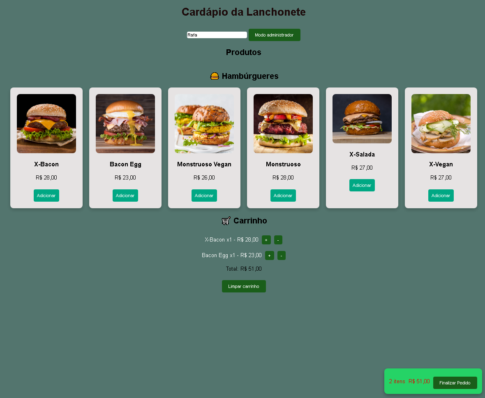
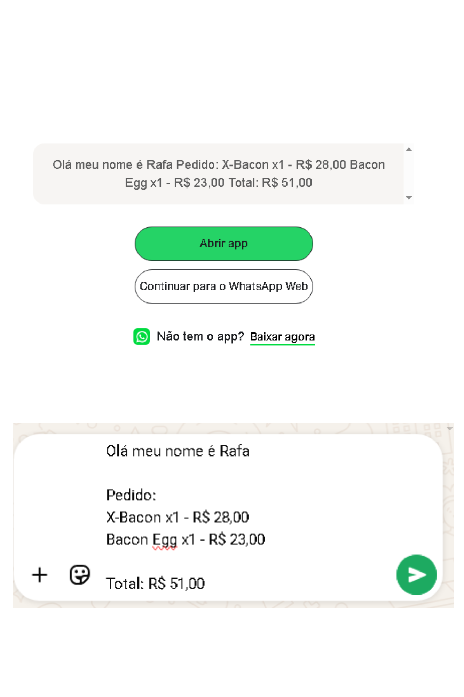
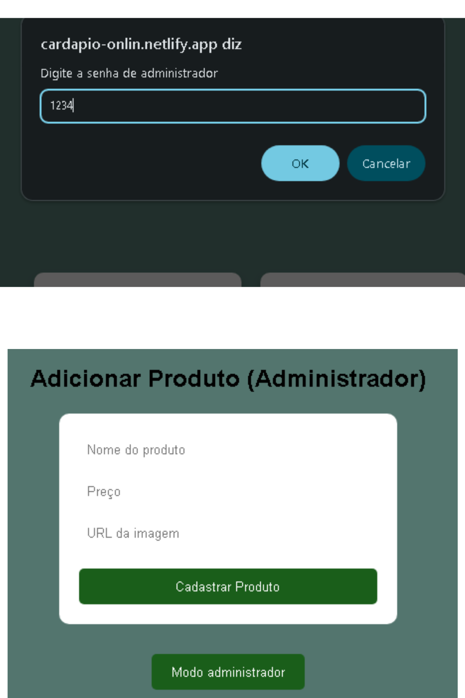

📌 Descrição do Projeto

Sistema de cardápio online com carrinho de compras, desenvolvido para simular o fluxo real de pedidos de um restaurante ou delivery. A aplicação permite que usuários naveguem pelos produtos, adicionem itens ao carrinho e finalizem pedidos de forma prática e intuitiva.

Além da experiência do cliente, o sistema também conta com uma área administrativa para cadastro de produtos, tornando o cardápio dinâmico e funcional.

🖼️ Preview do Projeto
📱 Tela Inicial

  

  

 ✉ Mensagem para o whatsZap

  

🧑‍💼 Área Administrativa

  

🚀 Funcionalidades
📋 Listagem de produtos com nome, descrição, preço e imagem
📂 Organização por categorias
🛒 Carrinho de compras funcional
➕ Adição automática de produtos ao clicar
💾 Persistência de dados utilizando LocalStorage
🔄 Manutenção dos itens no carrinho após recarregar a página
🧑‍💼 Cadastro de produtos através da área administrativa
📱 Interface responsiva (mobile e desktop)
💬 Integração com WhatsApp para envio de pedidos
🔐 Sistema de autenticação para área administrativa
🛠️ Tecnologias utilizadas
JavaScript
HTML
CSS
LocalStorage
🎯 Objetivo

Este projeto foi desenvolvido com foco em prática de desenvolvimento front-end, simulando um sistema real de pedidos online. A ideia foi criar uma solução útil para pequenos negócios, ao mesmo tempo em que aplica conceitos importantes como manipulação do DOM, gerenciamento de estado no cliente e persistência de dados.

💡 Diferenciais
🛒 Simulação de carrinho de compras sem necessidade de backend
💾 Armazenamento local persistente com LocalStorage
🧑‍💼 Funcionalidade administrativa integrada
📲 Experiência de usuário simples e direta
🔮 Melhorias futuras
🌐 Integração com backend (Node.js + MongoDB)
💳 Implementação de pagamento online
📦 Sistema de acompanhamento de pedidos

👨‍💻 Autor

Desenvolvido por Aldair como parte do seu portfólio de projetos.

🔗 Acesse o projeto

👉 https://cardapio-onlin.netlify.app
